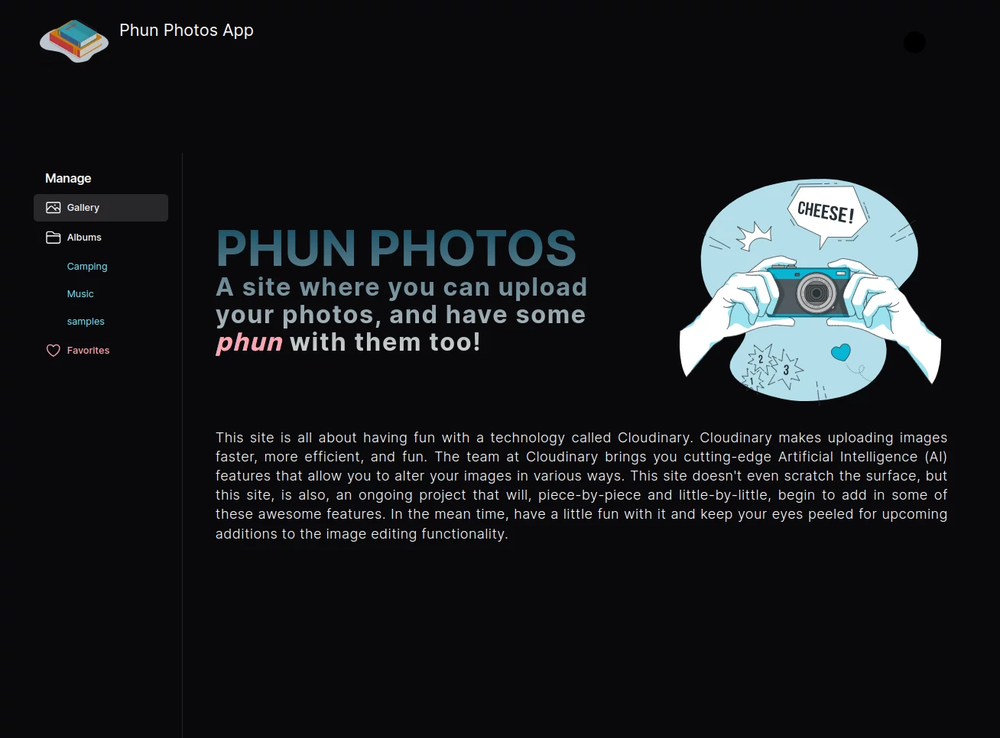
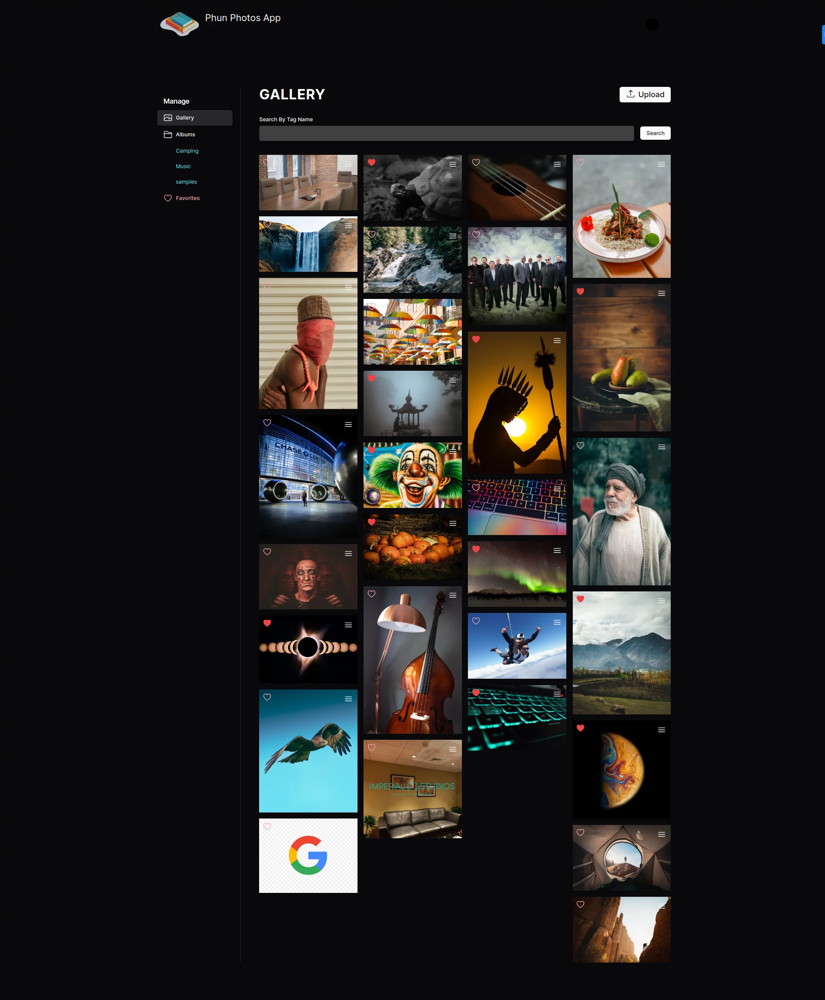
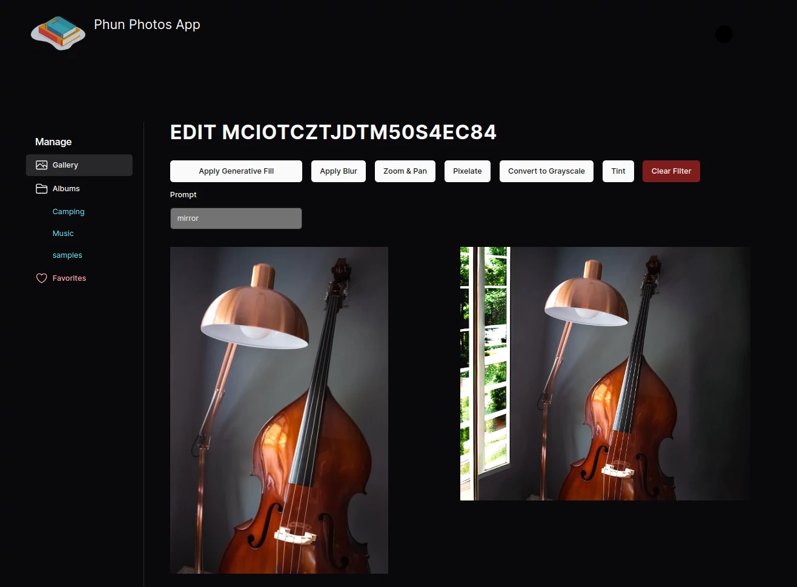
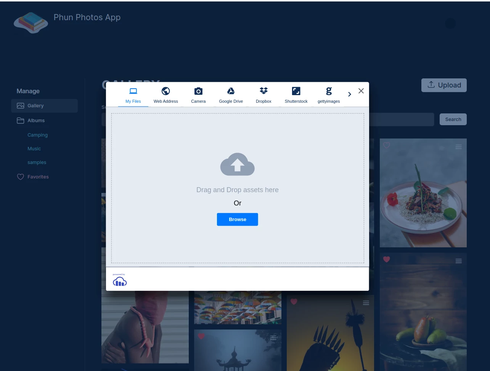

# Phun Photos

A Next.js 'fun project'.

### This app is a simple Next.js application utilizing Cloudinary. With no log in required, user can simply click the upload button, start uploading images from their local machine or some image sites provided by the Cloudinary platform. You can 'fovorite' images which will be rendered on the favorites page, accessible via the sidebar menu, and if you decide to 'unfavorite' an image, it will be removed from the favorites page.

### There is also an edit option (menu) on each image that when selected will navigate you to the edit page where you are allowed to use some built-in Artificial Intelligence filters on the selected image. These filters include: A prompt input field for adding content to the image, a blur feature, a zoom feature, a pixelate feature, a grayscale feature, and a tint feature. The image below demonstrates the addition of windows to the image of the upright bass and lamp.

  

[wlowrimore@gmail.com](mailto://wlowrimore@gmail.com) 
[www.linkedin.com](https://www.linkedin.com/in/william-lowrimore-dev) 
[www.williamlowrimore.com](https://www.williamlowrimore.com)
